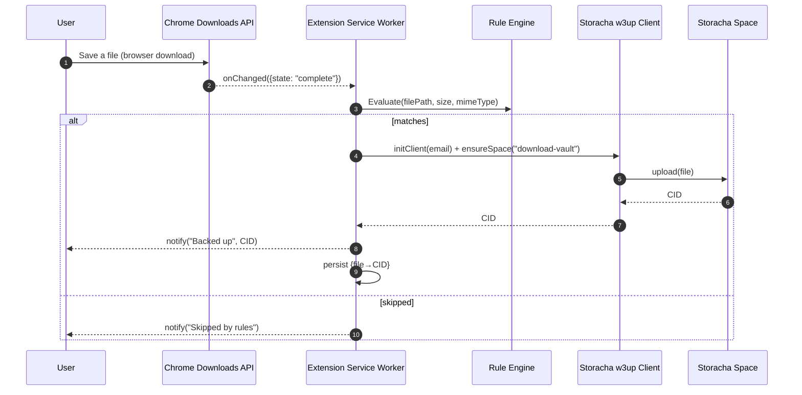

# Storacha Downloads Archiver

A Chrome Extension that automatically backs up your downloads into **your** Storacha Space. You control exactly what gets uploaded via include/exclude rules for file type, size, and folders. Each upload returns a **CID** you can retrieve from anywhere.

**Product spec / vision:** [Storacha Downloads Archiver — Product Documentation (Draft)](https://docs.google.com/document/d/11_DkDFZ9gTSH6BoDHQRNIx-CNi1Mdkc5anoFRrbYB_o/edit?usp=sharing)

> Demo: https://youtu.be/Ep2AEDxejtI

## Table of Contents

- [High Level Architecture](#high-level-architecture)
- [Installation](#installation)
- [Troubleshooting](#troubleshooting)
- [Contribution Guidelines](#contribution-guidelines)
- [FAQ](#faq)

---

## High Level Architecture

### Components

- **Service Worker (MV3 background):**
  Listens to `chrome.downloads` events, evaluates rules.
- **Rules & Settings (Options Page):**
  Simple UI backed by `chrome.storage.local` for include/exclude by type, size, folders, and space selection.
- **Uploader (Storacha w3up client):**
  Initializes with UCAN email flow, reuses or auto-creates a “download-vault” space, uploads file blobs, returns CID.
- **Index (Local):**
  Lightweight mapping of `{ filePath, size, mimeType, timestamp } → CID` in `IndexedDB`/`chrome.storage`.
- **Notifications:**
  Toasts to confirm successful backups or surface failures.

### Sequence (Download → CID)



### Rule Schema v2 (stored in `chrome.storage.local` as `rulesV2`)

Rule evaluation follows strict precedence: **Deny → Include → Size → Type**

```json
{
  "deny": {
    "extensions": ["exe", "bat", "tmp"], // Block these extensions
    "mimeTypes": ["application/x-executable"], // Block these MIME types
    "folders": ["*/temp/*", "*/cache/*"] // Block files in these folder patterns
  },
  "include": {
    "extensions": ["pdf", "jpg", "png", "*.doc*"], // Allow these extensions (supports globs)
    "mimeTypes": ["image/*", "application/pdf"], // Allow these MIME types (supports wildcards)
    "folders": ["*/Downloads/*", "*/Documents/*"] // Allow files in these folder patterns
  },
  "size": {
    "min": 0.1, // Minimum size in MB (null = no limit)
    "max": 100 // Maximum size in MB (null = no limit)
  }
}
```

**Rule Evaluation Logic:**

1. **Deny Rules**: If file matches any deny rule, upload is blocked
2. **Include Rules**: If include rules exist, file must match at least one
3. **Size Rules**: File size must be within min/max bounds
4. **Result**: File is uploaded only if it passes all checks

**Pattern Matching:**

- Extensions: Supports exact match (`pdf`) and globs (`*.doc*`)
- MIME types: Supports exact match (`application/pdf`) and wildcards (`image/*`)
- Folders: Supports glob patterns (`*/Downloads/*`, `~/Documents/**`)

---

## Installation

> Prereqs: Node 18+, pnpm or npm, Chrome/Edge (Manifest V3).

### 1) Clone & Install

```bash
git clone https://github.com/pranavvdesai/downloads-archiver-storacha.git
cd downloads-archiver-storacha
pnpm install   # or: npm install
```

### 2) Build

```bash
pnpm run build   # outputs to ./dist
```

### 3) Load in Chrome

1. Open `chrome://extensions`
2. Enable **Developer mode**
3. **Load unpacked** → select `./dist` (or your source folder)
4. Pin the extension (optional)

### 4) First-Run Setup

- Click the extension → **Open Options**
- **Sign in with email** (UCAN link flow)
- **Select or create** the `download-vault` space
- Configure **Selective Sync Rules** (types / size / folders)
- Download a small test file → you should see a success toast and a **CID** in logs

### 5) Dev Scripts (examples)

```bash
pnpm run dev     # watch + rebuild for MV3
pnpm run lint    # eslint/prettier
pnpm run typecheck
```

> **Permissions required in `manifest.json`:** `"downloads"`, `"storage"`, (optional) `"notifications"`.
> Options page registered via `"options_page": "options.html"` and background via `"service_worker"`.

---

## Troubleshooting

**Nothing uploads after I download a file**

- **Test your rules**: Use the "Test Your Rules" section in Options to verify your file would be allowed
- Confirm the file **matches your rules** following the Deny → Include → Size → Type precedence
- Check the Service Worker console: `chrome://extensions` → your extension → **Service Worker** → **Inspect**
- Make sure permissions include `"downloads"` and `"storage"` and the extension is **enabled**

**Rule Engine v2 Migration**

- Existing v1 rules are automatically migrated to v2 format
- Old rules: `{ types: ["pdf"], maxSize: 100, folders: ["Downloads"] }`
- Become: `{ include: { extensions: ["pdf"], folders: ["Downloads"] }, size: { max: 100 } }`

**Email login (UCAN) didn’t arrive**

- Check spam. Resend from Options → **Sign in**.
- Some corporate email filters block magic links; try a personal email for testing.

**Large files stall or fail**

- Try smaller file to verify path works.
- Watch logs for network errors.
- Temporarily set a lower `maxSize` to isolate size-related issues.

**I don’t see CIDs anywhere**

- Confirm the index write after upload; check stored mappings in `chrome.storage`/`IndexedDB`.

**Reset the extension**

- Options → remove/reload the extension and set up again.

---

## Contribution Guidelines

We welcome contributions! Here’s the quickest way to be helpful:

### Issues & Proposals

- Open a GitHub Issue with:

  - **Problem** (what’s broken / missing)
  - **Reproduction** (steps, sample file/rule)
  - **Expected vs Actual**
  - **Logs** (from Service Worker console)
 
- To pick up an issue:

  - Comment and ask for issues to be assigned.
  - Start working once assigned
    

### Dev Workflow

- Branch from `main`:

  ```
  feat/<short-name>    # new feature
  fix/<short-name>     # bug fix
  chore/<short-name>   # tooling, docs
  ```

- Use **Conventional Commits**:

  ```
  feat(rules): add folder prefix matching
  fix(uploader): backoff on 429
  ```

- Open a PR with:

  - What changed & why
  - Screenshots/GIFs for UI
  - Any migration notes (permissions, storage keys)

---

## FAQ

**Does it upload everything I download?**
No. Only files that match your **Selective Sync Rules**.

**Can I use multiple spaces?**
Current UX targets a single “download-vault” space. Multi-space & cross-profile enforcement is in the backlog.

**How do I get the file back later?**
Use the **CID** from the upload confirmation and retrieve via gateways or your preferred tools.

---
