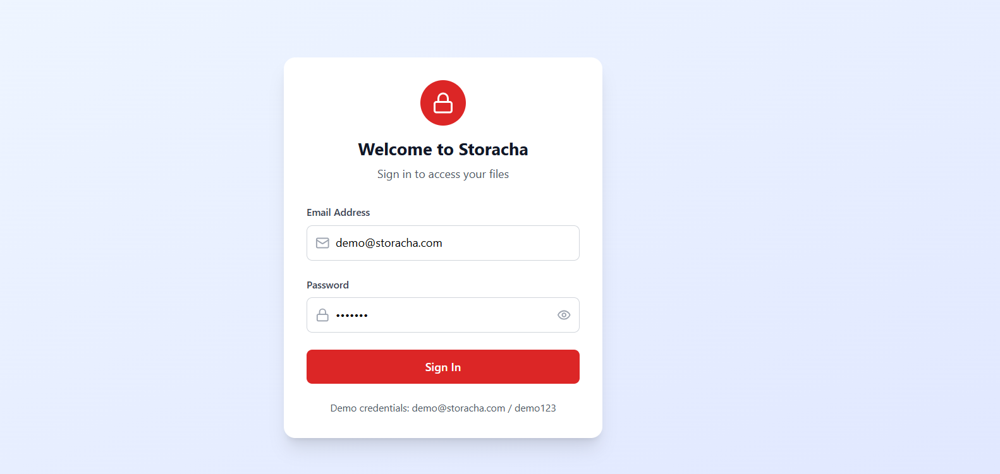
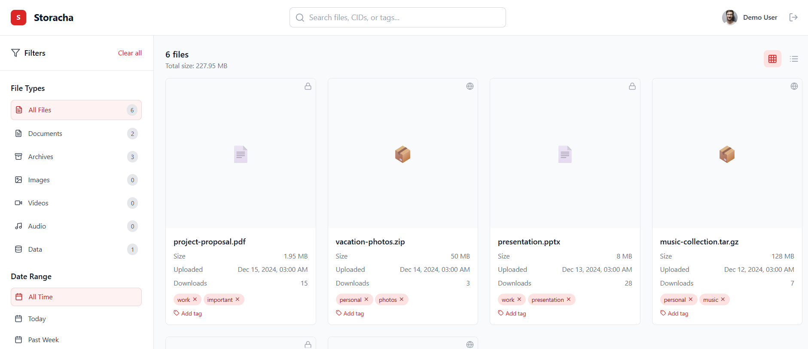

# Download Archiver Webapp

A modern, responsive web application for managing files stored on the Storacha network. Built with React, TypeScript, and Tailwind CSS, this application provides an intuitive interface for viewing, searching, filtering, and managing your decentralized files.

## ✨ Features

### 🔐 Authentication
- Secure user authentication system
- Session persistence with local storage
- Demo credentials for testing: `demo@storacha.com` / `demo123`




### 📁 Dashboard
- **Dual View Modes**: Switch between grid and list layouts
- **Advanced Search**: Search by filename, CID, or tags
- **Smart Filtering**: Filter by file type, date range, and tags
- **File Actions**: Copy CID to clipboard, download files, manage tags
- **Real-time Updates**: Live file statistics and metadata display




### 🎨 User Interface
- **Responsive Design**: Optimized for desktop, tablet, and mobile devices
- **Modern Aesthetics**: Clean, professional interface with smooth animations
- **Intuitive Navigation**: Collapsible sidebar with smart filtering options
- **Visual File Types**: Icon-based file type identification
- **Accessibility**: Keyboard navigation and screen reader support

## 🚀 Getting Started

### Prerequisites
- Node.js 18+ 
- npm or yarn package manager

### Installation

1. **Clone the repository**
   ```bash
   git clone https://github.com/Fatumayattani/download-archiver-storacha.git
   cd webapp
   ```

2. **Install dependencies**
   ```bash
   npm install
   ```

3. **Start the development server**
   ```bash
   npm run dev
   ```

4. **Open your browser**
   Navigate to `http://localhost:5173`

### Demo Access
Use these credentials to explore the application:
- **Email**: `demo@storacha.com`
- **Password**: `demo123`

## 🏗️ Project Structure

```
src/
├── components/          # React components
│   ├── AuthProvider.tsx    # Authentication context provider
│   ├── Dashboard.tsx       # Main dashboard layout
│   ├── FileCard.tsx        # Individual file display component
│   ├── FileGrid.tsx        # File grid/list container
│   ├── Header.tsx          # Application header with search
│   ├── Sidebar.tsx         # Filters and navigation sidebar
│   └── SignInForm.tsx      # Authentication form
├── hooks/               # Custom React hooks
│   ├── useAuth.ts          # Authentication logic
│   ├── useCache.ts         # Caching functionality
│   └── useFiles.ts         # File management logic
├── types/               # TypeScript type definitions
│   └── index.ts            # Application types
├── utils/               # Utility functions
│   └── fileUtils.ts        # File formatting and helper functions
├── App.tsx              # Main application component
├── main.tsx             # Application entry point
└── index.css            # Global styles and Tailwind imports
```

## 🛠️ Built With

### Core Technologies
- **[React 18](https://reactjs.org/)** - UI library with hooks and modern features
- **[TypeScript](https://www.typescriptlang.org/)** - Type-safe JavaScript
- **[Vite](https://vitejs.dev/)** - Fast build tool and development server
- **[Tailwind CSS](https://tailwindcss.com/)** - Utility-first CSS framework

### UI & Icons
- **[Lucide React](https://lucide.dev/)** - Beautiful, customizable icons
- **Custom Components** - Purpose-built UI components

### Development Tools
- **[ESLint](https://eslint.org/)** - Code linting and quality
- **[PostCSS](https://postcss.org/)** - CSS processing
- **[Autoprefixer](https://autoprefixer.github.io/)** - CSS vendor prefixing

## 📱 Responsive Design

The application is fully responsive and optimized for:

- **Desktop** (1024px+): Full sidebar, 4-column grid layout
- **Tablet** (768px-1023px): Collapsible sidebar, 2-3 column grid
- **Mobile** (320px-767px): Hidden sidebar with overlay, single column layout

## 🎯 Key Features Explained

### File Filtering & Search
- **Text Search**: Search across filenames, CIDs, and tags
- **File Type Filter**: Filter by document, archive, image, video, audio, or data files
- **Date Range Filter**: Show files from today, past week, or past month
- **Tag Filter**: Multi-select tag filtering with live counts
- **Sort Options**: Sort by name, date, size, or download count (ascending/descending)

### File Actions
- **Copy CID**: One-click CID copying to clipboard with visual feedback
- **Tag Management**: Add and remove tags with inline editing
- **Download**: Simulate file downloads (ready for Storacha integration)
- **Visibility Toggle**: View public/private file status

### Caching Strategy
- **5-minute cache**: Reduces API calls and improves performance
- **Smart invalidation**: Cache automatically expires and refreshes
- **Memory-based**: Uses Map for efficient in-memory storage


## 📄 License

This project is licensed under the MIT License - see the [LICENSE](LICENSE) file for details.

## 🙏 Acknowledgments

- **Storacha Network** - For decentralized file storage
- **React Team** - For the amazing React framework
- **Tailwind CSS** - For the utility-first CSS framework
- **Lucide** - For the beautiful icon set


**Built with ❤️ for the decentralized web**